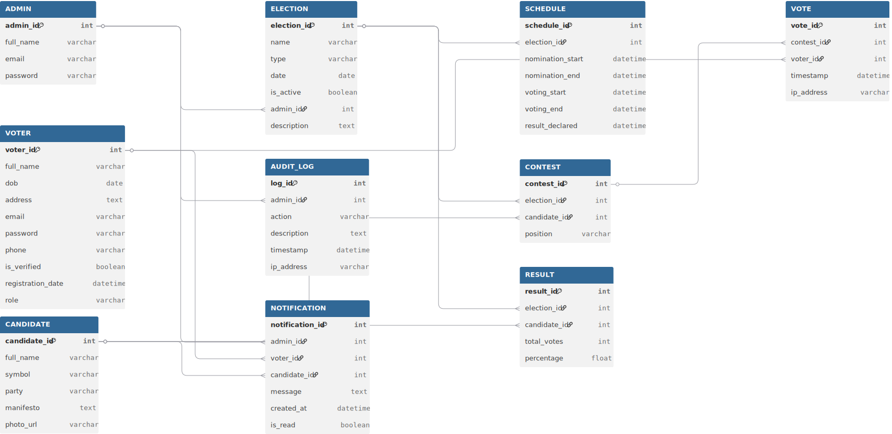
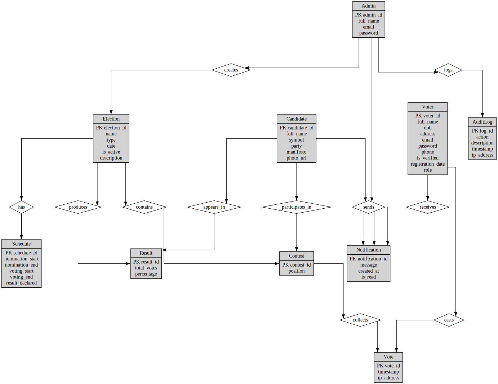

# Online Voting Management System
## Schema Diagram

## E-R Diagram

## Tables
```
CREATE TABLE ADMIN (
  admin_id INT PRIMARY KEY,
  full_name VARCHAR2(255),
  email VARCHAR2(255) UNIQUE,
  password VARCHAR2(255)
);


CREATE TABLE VOTER (
  voter_id INT PRIMARY KEY,
  full_name VARCHAR2(255),
  dob DATE,
  address CLOB,
  email VARCHAR2(255) UNIQUE,
  password VARCHAR2(255),
  phone VARCHAR2(20),
  is_verified CHAR(1),  -- Use 'Y'/'N' or 0/1 convention
  registration_date TIMESTAMP,
  role VARCHAR2(100)
);


CREATE TABLE CANDIDATE (
  candidate_id INT PRIMARY KEY,
  full_name VARCHAR2(255),
  symbol VARCHAR2(100),
  party VARCHAR2(255),
  manifesto CLOB,
  photo_url VARCHAR2(1000)
);

    
CREATE TABLE ELECTION (
  election_id INT PRIMARY KEY,
  name VARCHAR2(255),
  election_type VARCHAR2(100),
  election_date DATE,
  is_active CHAR(1),  -- Use 'Y'/'N' or 0/1 convention
  admin_id INT,
  description CLOB,
  CONSTRAINT fk_election_admin FOREIGN KEY (admin_id) REFERENCES ADMIN(admin_id)
);

    
CREATE TABLE SCHEDULE (
  schedule_id INT PRIMARY KEY,
  election_id INT,
  nomination_start TIMESTAMP,
  nomination_end TIMESTAMP,
  voting_start TIMESTAMP,
  voting_end TIMESTAMP,
  result_declared TIMESTAMP,
  CONSTRAINT fk_schedule_election FOREIGN KEY (election_id) REFERENCES ELECTION(election_id)
);

    
CREATE TABLE CONTEST (
  contest_id INT PRIMARY KEY,
  election_id INT,
  candidate_id INT,
  position VARCHAR2(100),
  CONSTRAINT fk_contest_election FOREIGN KEY (election_id) REFERENCES ELECTION(election_id),
  CONSTRAINT fk_contest_candidate FOREIGN KEY (candidate_id) REFERENCES CANDIDATE(candidate_id)
);


CREATE TABLE VOTE (
  vote_id INT PRIMARY KEY,
  contest_id INT,
  voter_id INT,
  vote_timestamp TIMESTAMP,
  ip_address VARCHAR2(50),
  CONSTRAINT fk_vote_contest FOREIGN KEY (contest_id) REFERENCES CONTEST(contest_id),
  CONSTRAINT fk_vote_voter FOREIGN KEY (voter_id) REFERENCES VOTER(voter_id)
);


CREATE TABLE RESULT (
  result_id INT PRIMARY KEY,
  election_id INT,
  candidate_id INT,
  total_votes INT,
  percentage FLOAT,
  CONSTRAINT fk_result_election FOREIGN KEY (election_id) REFERENCES ELECTION(election_id),
  CONSTRAINT fk_result_candidate FOREIGN KEY (candidate_id) REFERENCES CANDIDATE(candidate_id)
);


CREATE TABLE AUDIT_LOG (
  log_id INT PRIMARY KEY,
  admin_id INT,
  action VARCHAR2(255),
  description CLOB,
  timestamp TIMESTAMP,
  ip_address VARCHAR2(50),
  CONSTRAINT fk_audit_admin FOREIGN KEY (admin_id) REFERENCES ADMIN(admin_id)
);


CREATE TABLE NOTIFICATION (
  notification_id INT PRIMARY KEY,
  admin_id INT,
  voter_id INT,
  candidate_id INT,
  message CLOB,
  created_at TIMESTAMP,
  is_read CHAR(1),
  CONSTRAINT fk_notification_admin FOREIGN KEY (admin_id) REFERENCES ADMIN(admin_id),
  CONSTRAINT fk_notification_voter FOREIGN KEY (voter_id) REFERENCES VOTER(voter_id),
  CONSTRAINT fk_notification_candidate FOREIGN KEY (candidate_id) REFERENCES CANDIDATE(candidate_id)
);
```

## Insert Values
```INSERT INTO ADMIN VALUES (1, 'Alice Admin', 'alice@example.com', 'alice123');
INSERT INTO ADMIN VALUES (2, 'Bob Manager', 'bob@example.com', 'bob456');
INSERT INTO ADMIN VALUES (3, 'Carol Chief', 'carol@example.com', 'carol789');
INSERT INTO ADMIN VALUES (4, 'David Director', 'david@example.com', 'david111');
INSERT INTO ADMIN VALUES (5, 'Eva Executive', 'eva@example.com', 'eva222');


INSERT INTO VOTER VALUES (101, 'John Doe', DATE '1990-05-10', '123 Main St', 'john@example.com', 'pass1', '0123456789', 'Y', SYSTIMESTAMP, 'voter');
INSERT INTO VOTER VALUES (102, 'Jane Smith', DATE '1992-07-15', '456 Oak Ave', 'jane@example.com', 'pass2', '0198765432', 'N', SYSTIMESTAMP, 'voter');
INSERT INTO VOTER VALUES (103, 'Mike Khan', DATE '1988-03-20', '789 Pine Rd', 'mike@example.com', 'pass3', '0171234567', 'Y', SYSTIMESTAMP, 'voter');
INSERT INTO VOTER VALUES (104, 'Lina Ray', DATE '1995-01-30', '321 Maple St', 'lina@example.com', 'pass4', '0159876543', 'Y', SYSTIMESTAMP, 'voter');
INSERT INTO VOTER VALUES (105, 'Tom Lee', DATE '1991-11-11', '987 Cedar Blvd', 'tom@example.com', 'pass5', '0187654321', 'N', SYSTIMESTAMP, 'voter');


INSERT INTO CANDIDATE VALUES (201, 'Sarah Green', 'Tree', 'Green Party', 'Environment first!', 'url1.jpg');
INSERT INTO CANDIDATE VALUES (202, 'Rick Blue', 'Wave', 'Blue Party', 'Peace and Progress', 'url2.jpg');
INSERT INTO CANDIDATE VALUES (203, 'Nina Red', 'Rose', 'Red Party', 'Equality and Justice', 'url3.jpg');
INSERT INTO CANDIDATE VALUES (204, 'Omar Yellow', 'Sun', 'Sun Party', 'Bright Future', 'url4.jpg');
INSERT INTO CANDIDATE VALUES (205, 'Tina Purple', 'Star', 'Purple Party', 'Innovation Ahead', 'url5.jpg');


INSERT INTO ELECTION VALUES (301, 'National Election 2025', 'General', DATE '2025-12-01', 'Y', 1, 'Nationwide election');
INSERT INTO ELECTION VALUES (302, 'City Council Election', 'Local', DATE '2025-10-15', 'N', 2, 'City-level election');
INSERT INTO ELECTION VALUES (303, 'Student Union Vote', 'University', DATE '2025-08-20', 'Y', 3, 'DU Student elections');
INSERT INTO ELECTION VALUES (304, 'Mayor Election', 'Local', DATE '2025-09-05', 'N', 4, 'Local Mayor election');
INSERT INTO ELECTION VALUES (305, 'Women Leadership Poll', 'Special', DATE '2025-11-10', 'Y', 5, 'Empowering women leaders');


INSERT INTO SCHEDULE VALUES (401, 301, SYSTIMESTAMP, SYSTIMESTAMP + 5, SYSTIMESTAMP + 6, SYSTIMESTAMP + 10, SYSTIMESTAMP + 11);
INSERT INTO SCHEDULE VALUES (402, 302, SYSTIMESTAMP, SYSTIMESTAMP + 2, SYSTIMESTAMP + 3, SYSTIMESTAMP + 5, SYSTIMESTAMP + 6);
INSERT INTO SCHEDULE VALUES (403, 303, SYSTIMESTAMP, SYSTIMESTAMP + 1, SYSTIMESTAMP + 2, SYSTIMESTAMP + 3, SYSTIMESTAMP + 4);
INSERT INTO SCHEDULE VALUES (404, 304, SYSTIMESTAMP, SYSTIMESTAMP + 1, SYSTIMESTAMP + 2, SYSTIMESTAMP + 3, SYSTIMESTAMP + 4);
INSERT INTO SCHEDULE VALUES (405, 305, SYSTIMESTAMP, SYSTIMESTAMP + 2, SYSTIMESTAMP + 3, SYSTIMESTAMP + 4, SYSTIMESTAMP + 5);


INSERT INTO CONTEST VALUES (501, 301, 201, 'President');
INSERT INTO CONTEST VALUES (502, 301, 202, 'President');
INSERT INTO CONTEST VALUES (503, 302, 203, 'Mayor');
INSERT INTO CONTEST VALUES (504, 303, 204, 'Student Leader');
INSERT INTO CONTEST VALUES (505, 305, 205, 'Chairperson');


INSERT INTO VOTE VALUES (601, 501, 101, SYSTIMESTAMP, '192.168.1.1');
INSERT INTO VOTE VALUES (602, 501, 102, SYSTIMESTAMP, '192.168.1.2');
INSERT INTO VOTE VALUES (603, 502, 103, SYSTIMESTAMP, '192.168.1.3');
INSERT INTO VOTE VALUES (604, 503, 104, SYSTIMESTAMP, '192.168.1.4');
INSERT INTO VOTE VALUES (605, 504, 105, SYSTIMESTAMP, '192.168.1.5');


INSERT INTO RESULT VALUES (701, 301, 201, 120, 60.0);
INSERT INTO RESULT VALUES (702, 301, 202, 80, 40.0);
INSERT INTO RESULT VALUES (703, 302, 203, 200, 100.0);
INSERT INTO RESULT VALUES (704, 303, 204, 150, 100.0);
INSERT INTO RESULT VALUES (705, 305, 205, 300, 100.0);


INSERT INTO AUDIT_LOG VALUES (801, 1, 'CREATE_ELECTION', 'Created national election 2025', SYSTIMESTAMP, '10.0.0.1');
INSERT INTO AUDIT_LOG VALUES (802, 2, 'MODIFY_SCHEDULE', 'Updated schedule for election 302', SYSTIMESTAMP, '10.0.0.2');
INSERT INTO AUDIT_LOG VALUES (803, 3, 'DELETE_CANDIDATE', 'Removed inactive candidate', SYSTIMESTAMP, '10.0.0.3');
INSERT INTO AUDIT_LOG VALUES (804, 4, 'CREATE_CONTEST', 'Added contest for student election', SYSTIMESTAMP, '10.0.0.4');
INSERT INTO AUDIT_LOG VALUES (805, 5, 'PUBLISH_RESULT', 'Published results for women poll', SYSTIMESTAMP, '10.0.0.5');


INSERT INTO NOTIFICATION VALUES (901, 1, NULL, NULL, 'Election scheduled for 1st Dec', SYSTIMESTAMP, 'N');
INSERT INTO NOTIFICATION VALUES (902, NULL, 101, NULL, 'You are verified', SYSTIMESTAMP, 'Y');
INSERT INTO NOTIFICATION VALUES (903, NULL, NULL, 201, 'Update your photo', SYSTIMESTAMP, 'N');
INSERT INTO NOTIFICATION VALUES (904, 2, 102, NULL, 'Voting starts tomorrow', SYSTIMESTAMP, 'Y');
INSERT INTO NOTIFICATION VALUES (905, 3, NULL, 202, 'Submit manifesto by deadline', SYSTIMESTAMP, 'N');
```
## Tables
### Natural Join — Elections with Their Schedules
```
SELECT election_id, name, nomination_start, voting_start
FROM ELECTION
NATURAL JOIN SCHEDULE;
```
### Cross Product — Admin-Candidate Pairings
```
SELECT a.full_name AS admin_name, c.full_name AS candidate_name
FROM ADMIN a, CANDIDATE c;

```
### Outer Join — Voters and Any Votes Cast
```
SELECT v.voter_id, v.full_name, vt.vote_id
FROM VOTER v
LEFT OUTER JOIN VOTE vt ON v.voter_id = vt.voter_id;
```
## Directory Layout
```
online-voting-system/
│
├── 📁 public/                      # Frontend static files (HTML, CSS, JS)
│   ├── index.html                 # Login page
│   ├── vote.html                  # Voter dashboard (cast vote)
│   ├── admin.html                 # Admin dashboard
│   ├── styles.css                 # Shared styles
│   └── script.js                  # Shared JavaScript
│
├── 📁 routes/                      # Express route files
│   ├── authRoutes.js              # Login, logout for voter/admin
│   ├── voterRoutes.js             # Voter-specific routes (cast vote, view candidates)
│   ├── adminRoutes.js             # Admin routes (add candidate, view results)
│
├── 📁 controllers/                # Business logic separated from routes
│   ├── authController.js
│   ├── voterController.js
│   └── adminController.js
│
├── 📁 models/                     # Database query logic (optional: use SQL or ORM)
│   ├── voterModel.js
│   ├── candidateModel.js
│   └── voteModel.js
│
├── 📁 config/
│   └── db.js                      # PostgreSQL connection pool setup
│
├── 📁 middlewares/               # Middleware like auth, logging, etc.
│   └── authMiddleware.js
│
├── 📁 utils/                      # Helper functions (e.g., password hash)
│   └── hashPassword.js
│
├── 📁 sql/                        # Optional: SQL schema and seed data
│   ├── schema.sql
│   └── seed.sql
│
├── 📁 docs/                       # ER diagram, report, screenshots
│   ├── er-diagram.svg
│   ├── project-report.pdf
│   └── usage-guide.md
│
├── .gitignore
├── package.json
├── README.md
└── server.js                     # Main Express server entry point
```
